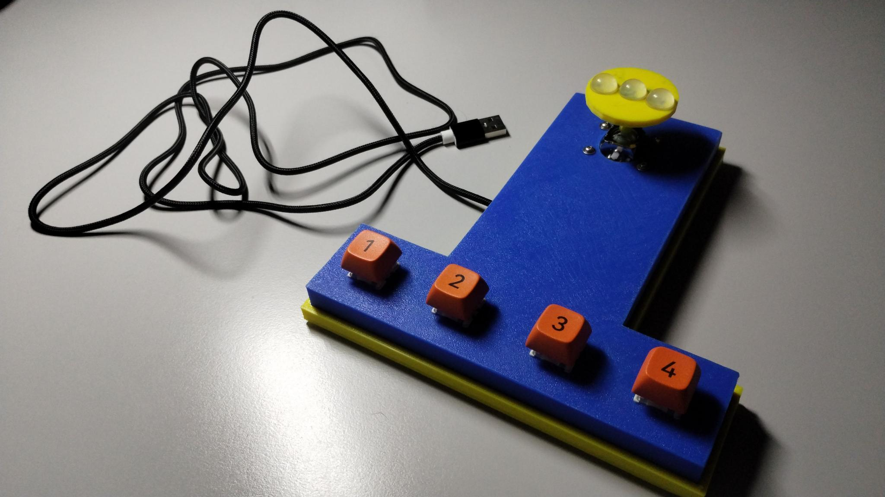

# Wrist controlled gamepad

This is a gamepad I designed for a disabled colleague who cannot bend
his fingers due to a spinal cord injury. The analog joystic is easy to
move with the fingertips, and four buttons can be pressed by the
wrist.

The gamepad runs a copy of [GP2040-CE
firmware](https://gp2040-ce.info/) on an RP2040-Zero board. The four
buttons are wired to GPIO that are mapped by default to buttons
B1..B4, and the joystick push button is mapped to A1. The mapping can
be changed easily in the GP2040 firmware cofiguration. See the
[schematics](wrist_gamepad_schematics.pdf) for reference.

On the bottom of the gamepad, a push-button is wired to the S2
signal. If you press and hold it and plug the USB connector in your
PC, the gamepad starts in configuration mode. You can change the
settings in a browser connected to
[http://192.168.7.1/](http://192.168.7.1/). See the [GP2040
documentation](https://gp2040-ce.info/web-configurator/) for more
details.

The top and bottom parts, as well as the joystick handle are printed
in PLA, 0.2mm layer height, no supports needed. The STL files are
available in [3Dprints](3Dprints/) folder.

Parts list:

* Waveshare RP2040-Zero board. Can also be any other [board supported
  by GP2040-CE firmware](https://gp2040-ce.info/downloads).

* KY-023 Dual Axis Joystick module
  ([1](https://www.amazon.com/dp/B0BPGRN48J),
  [2](https://www.aliexpress.com/item/2251832715984578.html).

* 4x M2.5*12 screws, 4x M2.5 nuts and 4x M2.5 washers.

* 4x MX keyboard switches, 4 XDA keycaps.

* a small push button for Arduino projects.

* USB-C cable.

* Wires, wire cutter, solderer, soldering iron.

* Hot glue gun (Epoxy would also be suitable).

* Self-adhesive round silicone bumpers (12x6mm for the joystick, 6x2mm
  for the feet).

Once soldered, fixate the keyboard switches and the USB cable with a
hot glue gun, and slide the bottom panel in.

In GP2040-CE web configurator, enable Analog joystick add-on, and map
GP26 to X-axis, and GP27 to Y-axis. Other GPIO pins are already wired
to their default mapping.

## Copyright and license

This work is licensed under Creative Commons
Attribution-NonCommercial-ShareAlike 4.0 International. To view a copy
of this license, visit
https://creativecommons.org/licenses/by-nc-sa/4.0/

Copyright (c) 2024 clackups@gmail.com

Fediverse: [@clackups@social.noleron.com](https://social.noleron.com/@clackups)
